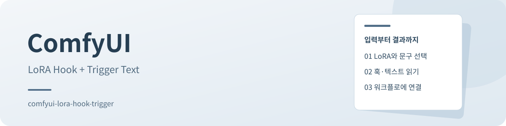

<div align="center">
  
  <h1>ComfyUI LoRA Hook + Trigger Text</h1>
  <p>선택한 LoRA의 훅과 트리거 문구를 함께 꺼냅니다.<br>LoRA 옆의 텍스트 파일을 읽어 HOOKS와 STRING으로 내보내는 ComfyUI 커스텀 노드입니다.</p>
  <p>소스 v1.0.3 · ComfyUI · 공개 저장소</p>
  <p><strong><a href="#시작하기">시작하기</a></strong> · <a href="#사용하기">사용 안내</a> · <a href="docs/README.md">문서 둘러보기</a></p>
</div>

[살펴보기](#살펴보기) · [시작하기](#시작하기) · [사용하기](#사용하기) · [확인된 범위](#확인된-범위) · [문서와 지원](#문서와-지원) · [이용 조건](#이용-조건)

## 살펴보기

| 항목 | 설명 | 안내 |
| :--- | :--- | :--- |
| 입력 자료 | ComfyUI에 등록한 LoRA와 같은 이름의 폴더에 둔 `.txt` 파일 | [트리거 파일 준비](#트리거-파일-준비) |
| 노드 | `advanced/hooks`의 **LoRA Hook + Trigger Text** | [노드 연결](#노드-연결) |
| 출력 | LoRA 훅 `HOOKS`와 선택 문구 `STRING` | [노드 입출력](#노드-입출력) |

실제 실행 화면과 워크플로 이미지는 현재 저장소에 없습니다. 아래 폴더 구성은 설명용 예시입니다.

<a id="설치"></a>
## 시작하기

### ComfyUI Manager

ComfyUI Manager에서 URL로 커스텀 노드를 설치하는 기능을 열고 다음 저장소 주소를 입력합니다.

```text
https://github.com/akaugun/comfyui-lora-hook-trigger
```

설치 후 ComfyUI를 다시 시작합니다. 메뉴 이름과 위치는 사용하는 Manager 버전에 따라 다를 수 있습니다.

### 직접 설치

ComfyUI의 `custom_nodes` 폴더에서 다음 명령을 실행합니다.

```sh
git clone https://github.com/akaugun/comfyui-lora-hook-trigger.git
```

설치 위치는 다음과 같아야 합니다.

```text
ComfyUI/custom_nodes/comfyui-lora-hook-trigger/
├── __init__.py
└── js/
    └── lora_trigger_ui.js
```

별도의 추가 패키지 목록은 없으며, ComfyUI의 Python 환경과 `comfy_extras.nodes_hooks` API를 사용합니다. 이 저장소에는 시험한 ComfyUI 버전이나 호환 최소 버전이 기록되어 있지 않습니다.

## 사용하기

### 트리거 파일 준비

LoRA 파일 옆에 **확장자를 뺀 LoRA 파일명과 같은 폴더**를 만들고, 그 안에 소문자 `.txt` 확장자의 트리거 파일을 저장합니다. 아래 이름과 문구는 설명용 예시입니다.

```text
models/loras/
├── my_lora.safetensors
└── my_lora/
    ├── portrait.txt
    └── style.txt
```

예를 들어 `portrait.txt`에는 사용할 프롬프트 문구를 적습니다. 실제 LoRA 위치는 ComfyUI에 등록한 LoRA 경로를 따릅니다.

### 노드 연결

1. `advanced/hooks`에서 **LoRA Hook + Trigger Text** 노드를 추가합니다.
2. `lora_name`에서 LoRA를 고르고, `trigger`에서 텍스트 파일명을 고릅니다. 목록에는 확장자를 뺀 이름이 표시됩니다.
3. `strength_model`과 `strength_clip`을 정합니다.
4. `hook`을 `HOOKS` 입력을 받는 노드에, `trigger_text`를 프롬프트 문자열 입력에 연결합니다. 훅 적용과 프롬프트 조합은 사용하는 워크플로에서 정합니다.

`NONE`을 고르면 트리거 문구는 빈 문자열입니다. 파일이 없거나 읽을 수 없는 경우에도 빈 문자열을 반환합니다. 텍스트는 UTF-8-SIG, UTF-8, CP949 순서로 읽고, 모두 실패하면 UTF-8 대체 문자 읽기를 시도합니다.

### 노드 입출력

| 입력 | 형식 | 역할 |
|---|---|---|
| `lora_name` | 목록 | ComfyUI에 등록된 LoRA 선택 |
| `trigger` | 문자열 | 선택한 파일명 또는 `NONE` |
| `strength_model` | 실수 | 모델에 적용할 LoRA 강도 |
| `strength_clip` | 실수 | CLIP에 적용할 LoRA 강도 |
| `prev_hooks` | `HOOKS`, 선택 | 앞에서 만든 훅 그룹 |

| 출력 | 형식 | 내용 |
|---|---|---|
| `hook` | `HOOKS` | 생성하거나 결합한 LoRA 훅 |
| `trigger_text` | `STRING` | 선택한 텍스트 파일의 내용 |

## 확인된 범위

| 확인 항목 | 상태 | 근거 |
| :--- | :--- | :--- |
| 버전·등록 정보 | 소스 v1.0.3 | [패키지 메타데이터](pyproject.toml) |
| 트리거 읽기·훅 생성 | 현재 소스에서 입출력·폴더명·인코딩 순서 확인 | [Python 노드](__init__.py) |
| 선택 목록 갱신 | 현재 소스에서 조회·표시·직렬화 경계 확인 | [브라우저 확장](js/lora_trigger_ui.js) |
| 실제 ComfyUI 실행·호환판 | 시험한 버전과 최소 호환 버전 미기록 | [현재 메타데이터](pyproject.toml) |

소스 확인은 실제 워크플로 실행이나 호환성 통과를 뜻하지 않습니다. 설치 후 사용하는 ComfyUI 버전에서 노드와 훅 결과를 확인하세요.

## 문서와 지원

[문서 둘러보기](docs/README.md)에서 설치, 사용과 구현 경로를 찾습니다. [릴리스](https://github.com/akaugun/comfyui-lora-hook-trigger/releases)에서 게시 기록을 확인합니다.

### 문제 확인

- **노드가 보이지 않음:** 설치 폴더와 ComfyUI 시작 로그를 확인하고 ComfyUI를 다시 시작합니다
- **트리거가 `NONE`만 표시됨:** 선택한 LoRA 옆의 폴더명과 `.txt` 파일을 확인합니다. LoRA를 다시 선택하면 목록을 조회합니다
- **문구가 비어 있음:** `NONE` 선택 여부, 파일명·확장자·내용과 읽기 권한을 확인합니다
- **브라우저의 선택 목록이 갱신되지 않음:** ComfyUI 재시작 후 브라우저를 강력 새로고침합니다. Windows/Linux는 `Ctrl+F5`, macOS는 `Cmd+Shift+R`입니다
- **훅 결과가 예상과 다름:** ComfyUI 버전과 훅 API를 확인합니다. 이 구현은 API를 가져오거나 호출하지 못하면 기존 훅 또는 빈 결과를 반환할 수 있습니다

문제는 [이슈](https://github.com/akaugun/comfyui-lora-hook-trigger/issues)에 ComfyUI 버전, 재현 순서와 오류를 남깁니다. 개인 경로·프롬프트·모델 파일은 공유 전에 확인하세요.

### 구현

- [Python 노드](./__init__.py): LoRA 경로 조회, `/lora_trigger_list` 목록 API, 텍스트 읽기와 훅 생성
- [브라우저 확장](./js/lora_trigger_ui.js): 선택 목록 조회와 표시. UI용 목록은 따로 직렬화하지 않고 기존 `trigger` 값을 갱신합니다
- [패키지 메타데이터](./pyproject.toml): 버전과 Comfy Registry 등록 정보

<details>
<summary>English summary</summary>

### English summary

ComfyUI custom node that returns a LoRA hook and trigger text from a folder named after the selected LoRA. The current repository has no LICENSE file or documented tested ComfyUI version.

</details>

<a id="라이선스-상태"></a>
## 이용 조건

현재 기본 브랜치에는 `LICENSE` 파일이 없습니다. 기존 README와 `pyproject.toml`의 라이선스 파일 표기는 실제 저장소 파일과 일치하지 않습니다.
